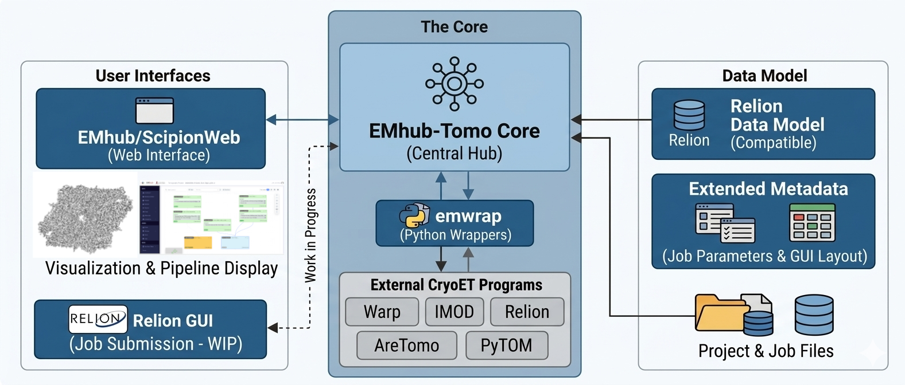

.. EMhub-Tomo documentation master file, created by
   sphinx-quickstart on Fri Aug 28 14:47:01 2026.
   You can adapt this file completely to your liking, but it should at least
   contain the root `toctree` directive.

Welcome to EMhub-Tomo!
======================

**EMhub-Tomo** is a platform for CryoET data processing that facilitates the execution of heterogenous pipelines in a flexible and structured way.
It is based on the **emwrap** library, which provides Python wrappers for executing external programs in a consistent way. 
Proccessing jobs and projects are compatible with the Relion data model, but extended with a form definition for the job parameters and 
GUI layout. **EMhub-Tomo** provides a web interface based on **emhub** and **ScipionWeb** components for displaying the processing pipeline 
and visualizing the results. Defined jobs can also be executed from Relion's GUI (*work in progress*).

Installation in 3 easy steps
-----------------------------

#. Create the Python environment and install the sources.
#. Configure program launchers and cluster queues for your site.
#. Run some automated tests to ensure the installation is working correctly.

1. Python environment
.....................

**EMhub-Tomo** needs Python 3.8, available through either an active conda environment or a plain Python venv -- the install script auto-detects 
whichever one is active. See :doc:`python_environment` for how to install conda, or use a venv instead.

.. code-block:: bash

   # Create a folder for the installation
   mkdir emhub && cd emhub

   # Create a conda environment and activate it
   conda create -y --name=emhub python=3.8 && conda activate emhub

   # Download and run the install script
   wget -qO- https://3dem.github.io/emhub-tomo/install.sh | bash

The install script clones the `emtools`, `emhub`, and `emwrap` repositories into a `source` folder, generates a `bashrc` file to (re)activate 
the detected conda/venv environment, and generates an executable `emh-tomo` script in the installation folder. As its last step, the installer 
also runs `./emh-tomo --update` to set up the configuration files -- see `2. Configuration`_ below to adapt the program launchers and cluster 
queues to your site.

Once configured, run the server with:

.. code-block:: bash

   ./emh-tomo --run

`./emh-tomo --run` starts the emhub instance stored at `~/.emhub/instances/tomo` (creating it the first time from a minimal instance, together 
with the processing "extra" files shipped with emhub). The server is started on a free port chosen automatically and printed in green, together 
with a ready-to-use `ssh -L` tunnel command for connecting from a client machine when **EMhub-Tomo** runs on a remote or HPC host. The admin 
user is logged in automatically, so no login step is required for this use case.

2. Configuration
................

`./emh-tomo --update` creates a `emwrap.bashrc` file in the installation folder if it does not exist yet 
(this happens automatically once at the end of the installation). 
This is the main configuration file that has references to other files and settings. 
From there, the `bashrc` file is sourced to load the required Python/Conda
environment. The environment variable `EMWRAP_CONFIG` is defined in the `emwrap.bashrc` file, as a JSON literal. You should
modify its content to adapt to your computing needs regarding programs, queues, and other settings.

.. code-block:: bash

   # Update the configuration files and pull the latest changes for the
   # emtools/emhub/emwrap source checkouts
   ./emh-tomo --update

   # Inspect or validate the current configuration
   ./emh-tomo --config list
   ./emh-tomo --config check

See :doc:`launchers` and :doc:`queues` for how to configure program launchers and cluster queues in detail.

2.1 Program Launchers
~~~~~~~~~~~~~~~~~~~~~

In **emwrap**, external programs can be defined by specifying "program launchers": bash scripts that wrap a program call and set up whatever environment it needs (loading cluster modules, sourcing other bash files, setting environment variables, etc.), so that **emwrap** itself does not need to know about local installation details.

Launchers are configured in the *programs* section of the *EMWRAP_CONFIG* variable, and after installation a *scripts* folder is created with example launcher scripts that you will likely need to adapt to your environment. Jobs implemented in **emwrap** use ``$ROOT/emh-tomo --launch`` as the ``EMWRAP`` launcher (no separate shell script).

See :doc:`launchers` for the *programs* configuration example and detailed launcher examples (Warp, Relion, and others).

2.2 Cluster Queues
~~~~~~~~~~~~~~~~~~

After the program launchers, the next section of *EMWRAP_CONFIG* is the definition of cluster queues. You can define as many queues as you need, and each queue can have a different job script template, submit command, and parameters (for example, letting the user pick a GPU type).

See :doc:`queues` for the *queues* configuration example and details on writing job script templates (including SLURM and LSF examples).

3. Running Tests
................

Running automated tests is a good way to ensure that the installation is working correctly. 

You can use the same ``./emh-tomo`` entry point to discover and launch some tests. 

.. code-block:: bash

   # List the available tests
   ./emh-tomo --test list

   # Create a project to run the tests
   mkdir TestProject && cd TestProject
   emw -c .

   # Run the Warp test with 2 GPUs
   ./emh-tomo --test apof_warp -p . -g 2 -w medium

   # Or run AreTomo3 test with 1 GPU
   ./emh-tomo --test apof_aretomo3 -p . -g 1

These test require to have a test data set available. See more information about how to run tests here: :doc:`running_tests`.

Other Features
--------------

Processing Jobs
...............

Processing jobs in **EMhub-Tomo** follow the same convention as Relion's `External job type`_: each job runs in its own 
job folder with an input arguments file and writes to an output folder, reporting success or failure the same way a 
native Relion job would -- so pipelines built from **EMhub-Tomo** jobs stay visible and reusable from within Relion itself.

.. _External job type: https://relion.readthedocs.io/en/release-5.0/Reference/Using-RELION.html#the-external-job-type

On top of that convention, each job type ships its own ``form.json`` file (see ``emwrap/config/forms``) describing the 
parameters shown to the user and how they are organized in the Form UI. See :doc:`job_forms` for the full reference.

See :doc:`tomography_jobs` for the job types currently implemented for CryoET processing, grouped software package 
(Warp, Relion, PyTOM, AreTomo, and emwrap's own jobs).

Workflows
.........

Workflows are defined in the `workflows` folder. Each workflow is a JSON file that defines the jobs to be executed 
in sequence, together with the parameters passed to each. The idea is that processing pipelines built in **EMhub-Tomo** 
can be exported as workflows and reused in other projects.

.. toctree::
   :hidden:

   Overview <self>

.. toctree::
   :maxdepth: 2
   :caption: Installation
   :hidden:

   python_environment
   launchers
   queues
   running_tests

.. toctree::
   :maxdepth: 2
   :caption: Jobs
   :hidden:

   job_forms
   tomography_jobs

