Warp ApoF Tutorial
====================

.. note::

   This page is a work in progress. The screenshots were taken from a project where both
   parts of the workflow had already been run, so every job appears as *finished*.

This tutorial walks through the full Warp-based apoferritin (ApoF) processing pipeline in
**EMhub-Tomo**, from importing raw tilt-series data all the way to a multi-particle (M)
refinement, mixing **Warp**, **PyTOM**, and **Relion**.

The pipeline is split into two workflows of 11 jobs each, which you can run in two sittings:
``apof-warp-tutorial-part1`` (preprocessing, particle picking, and the first Relion
refinement) and ``apof-warp-tutorial-part2`` (the M refinement stage). Load them into the
same project, one after the other, since part 2 continues from the M population created at
the end of part 1.

Before You Start
------------------

* **EMhub-Tomo** must be installed and configured -- see :doc:`index` for the installation
  steps.
* The launchers for **WARP**, **RELION**, **PYTOM**, and **ARETOMO2** must be configured and
  working for your site (AreTomo2 is used internally by the Warp tilt-series alignment step).
  See :doc:`launchers` for how to set these up, for example against an SBGrid installation.
* The required test data, ``WarpApofTutorial`` (5 apoferritin tilt series from EMPIAR-10491),
  must be downloaded -- see :doc:`test_data` for how to get it and its expected layout.

Creating a Project
--------------------

Open the **Tomography** section in the left sidebar to see the *Tomo Processing* page.
It lists your projects (grouped by date) and projects shared with you. Click
**Create New Project** to open the project form.

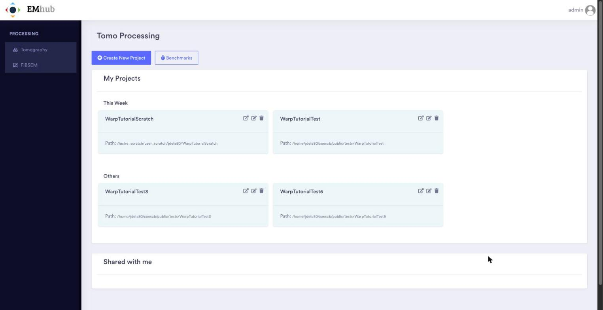

   The Tomo Processing page with the list of existing projects.

In the form, enter a **Title** and an optional **Description**, then set the
**PROCESSING path**. This is the folder where the project will be created: the last folder
in the path must not exist yet, but its parent must exist and be writable. The
**DATA path** is optional. If you set it, a ``data`` link to the raw data folder is created
inside the project so that all inputs can be given relative to the project root. The
**Sharing** tab lets you share the project with other users. Click **Create** to create
the project.

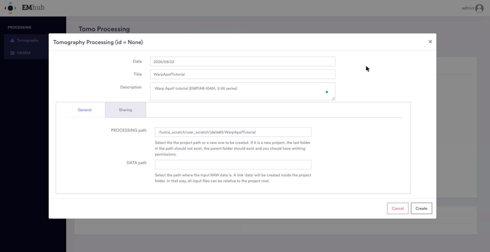

   Creating a new project for the tutorial.

Opening a Project
-------------------

Back on the project list, click the *open* icon (the first of the three icons on the
project card) to open the project. The second icon edits the project settings with the same
form used to create it, and the third one deletes the project.

A project can be shown in several **View modes** (top right): the workflow graph, a grid
of job cards, and a table with every job, its protocol, state, elapsed time and dependent
jobs. The screenshot below shows the grid view of a project where the full tutorial has
already been run.

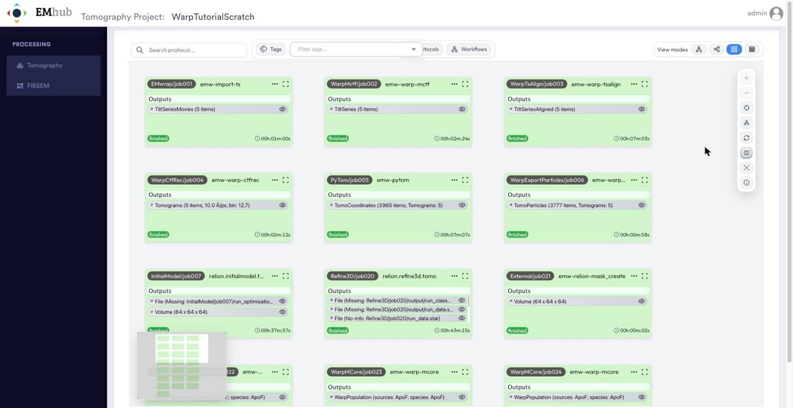

   A project opened in the grid view mode.

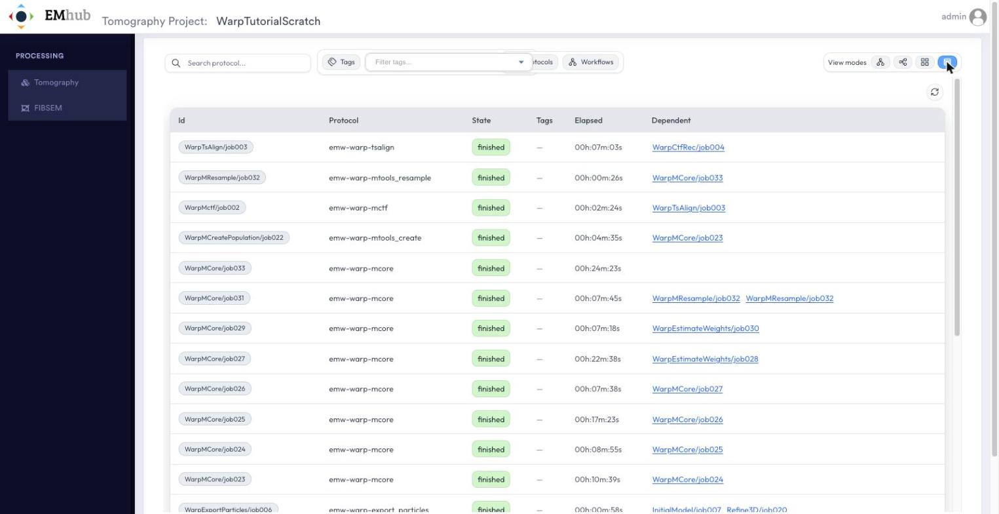

   The same project in the table view mode.

Loading the Workflow
----------------------

Once the test data is in place, open the project and click **Workflows** in the toolbar.
The *Workflows* panel lists the predefined templates that can be loaded into the current
project. **Double-click** ``ApoF - Warp + PyTOM + Relion`` (``apof-warp-tutorial-part1``)
to add its 11 jobs to the project, already linked together and pre-filled with the
parameters needed for this dataset. You can then launch them in order. When they are done,
load ``ApoF - M Refinements`` (``apof-warp-tutorial-part2``) into the same project for the
remaining 11 jobs.

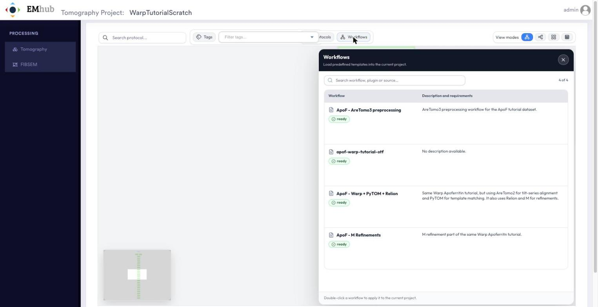

   The Workflows panel. Double-click a workflow to apply it to the current project.

.. warning::

   Every time a workflow is applied, a new copy of all its jobs is added to the project.
   Load each part only once.

Job Forms
-----------

Each job box in the graph shows its outputs, state and elapsed time. Click the ``...`` button
to open the job menu. Choose **Open** (or double-click the job) to see
its form. From the same menu you can browse the job folder, annotate, tag, duplicate,
export or delete the job, and select a range of jobs (**Select from** / **Select to**).

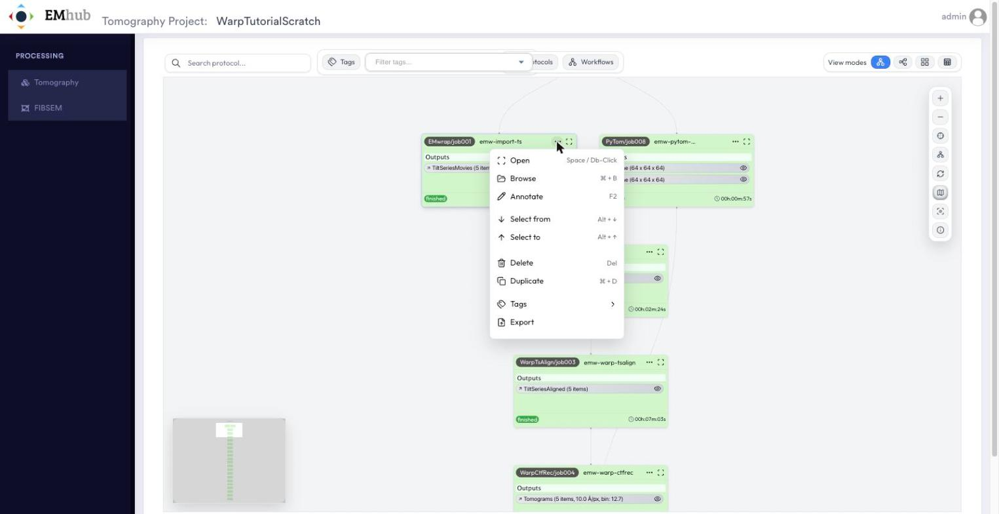

   The job menu in the workflow graph.

The job form has an **Inputs and Parameters** tab, where parameters are grouped into
sub-tabs, plus **Outputs**, **Logs** and **Metadata** tabs. The workflow pre-fills the
parameters. For example, the **EMwrap Import TS** job points to the frames, mdoc files
and gain reference under ``data/`` and sets the acquisition parameters for EMPIAR-10491.
Use **Save** to keep changes and **Launch** to run the job.

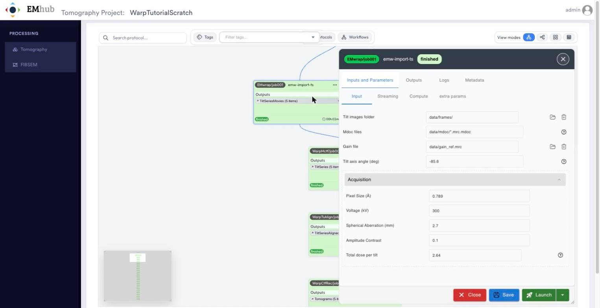

   Form of the EMwrap Import TS job, with the acquisition parameters of the dataset.

The **Compute** sub-tab selects the queue that the job is submitted to (see :doc:`queues`).

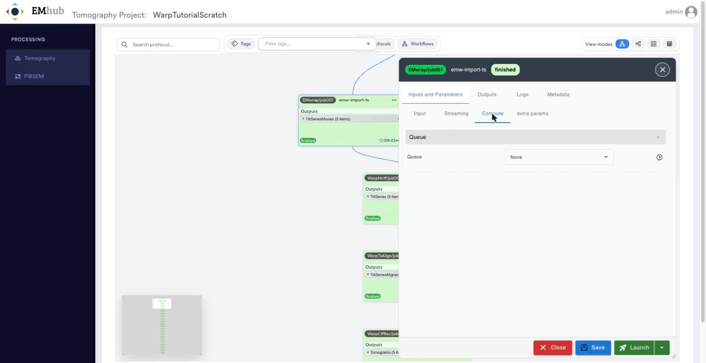

   The Compute sub-tab, where the execution queue is chosen.

Workflow Steps
----------------

1. Preprocessing
~~~~~~~~~~~~~~~~~~

* **EMwrap Import TS** (``emw-import-ts``) -- import the raw frames, mdocs, and gain reference
  from ``testdata/WarpApofTutorial`` as tilt series, using the dataset's acquisition
  parameters.
* **Warp Motion and CTF** (``emw-warp-mctf``) -- per-tilt motion correction and CTF estimation
  with Warp.
* **Warp Tilt Series Alignment** (``emw-warp-tsalign``) -- tilt-series alignment, using
  AreTomo2 by default.
* **Warp CTF and Reconstruction** (``emw-warp-ctfrec``) -- 3D CTF correction and tomogram
  reconstruction.

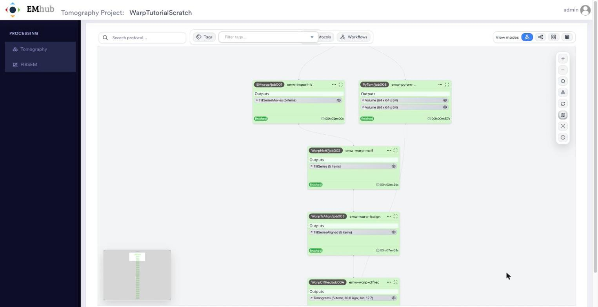

   The preprocessing jobs in the workflow graph. The PyTom Create Template job (job008) does not depend on them and runs in parallel.

Click the eye icon of an output to inspect it. Outputs built on tilt series (tomograms,
coordinates) are listed in a table, one row per tilt series. The **tilt angles**,
**motion** and **defocus** actions at the end of each row plot the per-tilt values in the
*Viewer* panel.

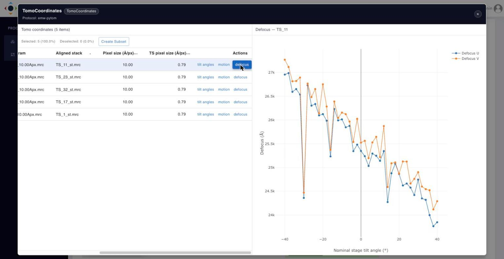

   Per-tilt defocus estimated by Warp for tilt series TS_11.

2. Particle Picking
~~~~~~~~~~~~~~~~~~~~~

* **PyTom Create Template** (``emw-pytom-create_template``) -- build the template and mask
  used for template matching from the reference map ``data/emd_15854.map``. This job has no
  dependencies, so it can be launched at any point before the template matching step.
* **PyTom Template Matching** (``emw-pytom``) -- 3D template matching to locate apoferritin
  particles in the reconstructed tomograms.
* **Warp Export Particles** (``emw-warp-export_particles``) -- export the picked particle
  coordinates/subtomograms from Warp for refinement in Relion.

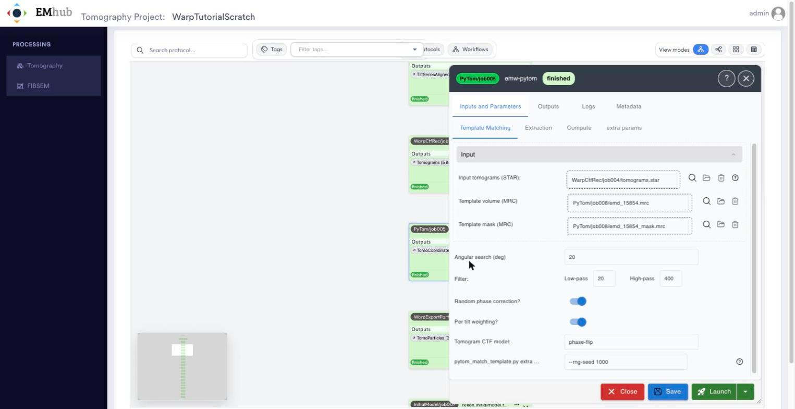

   Form of the PyTom Template Matching job. Its inputs are linked to the tomograms from WarpCtfRec/job004 and to the template and mask from PyTom/job008.

To check the picked particles, click the eye icon of the ``TomoCoordinates`` output of the
PyTom job and then click the tomogram name of any row. The viewer shows orthogonal slices
of the tomogram. Use the sliders to move through them, and turn the picked coordinates
on or off with **Show particles**.

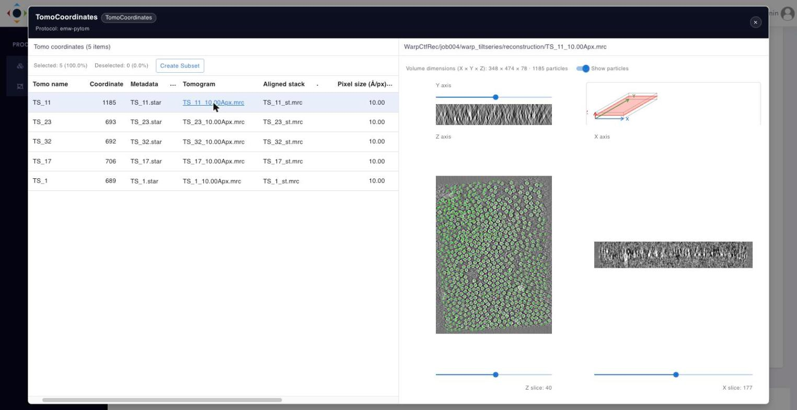

   PyTOM template matching results: the 1185 particles picked in TS_11 shown on the tomogram slices.

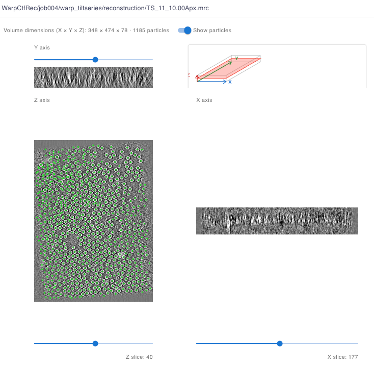

   Close-up of the viewer: picked coordinates (green) on a Z slice of TS_11.

3. Initial 3D Refinement
~~~~~~~~~~~~~~~~~~~~~~~~~~

* **Relion Tomo Initial Volume** (``relion.initialmodel.tomo``) -- generate an initial 3D
  model from the exported particles.
* **Relion Tomo Refine** (``relion.refine3d.tomo``) -- a first 3D auto-refinement against the
  initial model.
* **Relion Mask Create** (``emw-relion-mask_create``) -- create a mask from the refined map,
  used by the M refinement stage that follows.

Clicking the eye icon of a ``Volume`` output opens the map viewer with axis sliders,
a slices gallery and an interactive 3D isosurface. The threshold slider under the 3D view
sets the contour level.

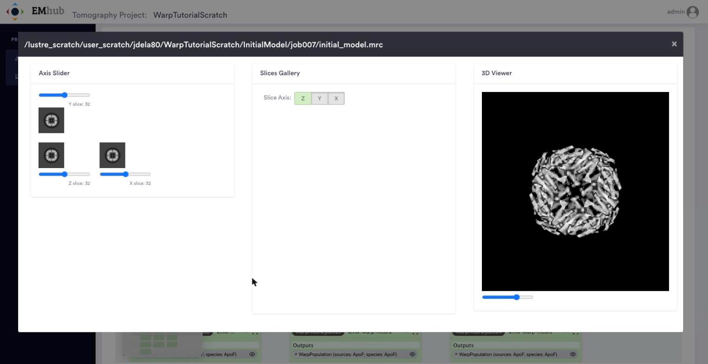

   The initial model generated by Relion (InitialModel/job007).

4. M (Multi-Particle) Refinement
~~~~~~~~~~~~~~~~~~~~~~~~~~~~~~~~~~

The last job of part 1 sets up the M refinement, and the whole of part 2 runs it, alternating
refinement iterations (**Warp MCore Refine**, ``emw-warp-mcore``) with weight re-estimation
(**Warp Estimate Weights**, ``emw-warp-estimate_weights``), and a resampling step partway
through:

* **Warp M Create Population** (``emw-warp-mtools_create``) -- create the M population from
  the Relion refinement and mask. This is the last job of ``apof-warp-tutorial-part1``; the
  jobs below come from ``apof-warp-tutorial-part2``.
* **Warp MCore Refine** -- run five times in a row to refine particle poses/warp fields.
* **Warp Estimate Weights** -- re-estimate per-particle/per-tilt weights.
* **Warp MCore Refine** -- another refinement round.
* **Warp Estimate Weights** -- weights re-estimated again.
* **Warp MCore Refine** -- another refinement round.
* **Warp M Resample** (``emw-warp-mtools_resample``) -- resample the M population (e.g. to a
  finer pixel size) for a final round.
* **Warp MCore Refine** -- the final refinement round, against the resampled population.

The eye icon of the ``WarpPopulation`` output of any M job opens the population
viewer. It lists the files of the population (maps, half maps, masks, local resolution,
etc.), displays the selected map in 3D, and plots the Fourier Shell Correlation curves
computed by M.

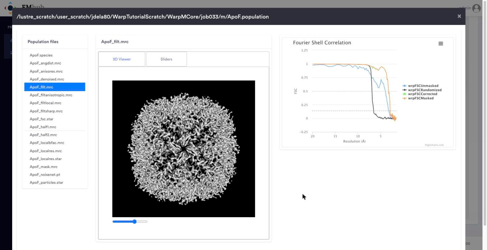

   Final result after the last M refinement (WarpMCore/job033): the filtered ApoF map and the FSC curves.

Results
---------

.. TODO: summarize/screenshot the final outputs once this section is completed (final map,
   resolution, and where to find the output files for each job).
